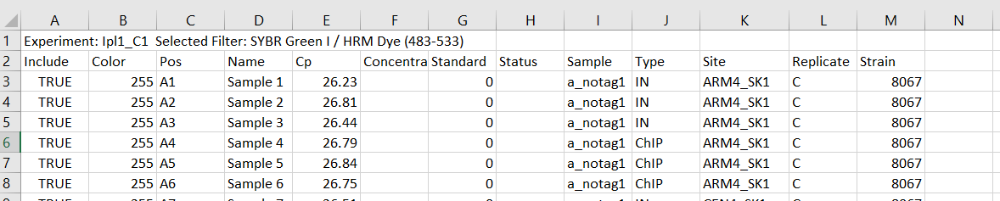

## Hello all lab R people,

I am making an R script to streamline our ChIP analysis. The excel file is so 2000s and it is very easy to make mistakes there while copying and I don't want to deal with its issues anymore. I hope to make everything as automated as possible and if I am very nice (or bored) I will try to make shiny app to make the analysis do itself. But we will see. So far it is written in a lovely R markdown so you will be able to make a nice html or pdf file to add straight to your benchling.It will also write tables with the calculations as external files so all of them will be preserved and everything will be much easier to read than it is now.

This is written to be compatible with R version 4.0.3 and RStudio Version 1.4.1103. These are the newest versions available at the time when I started writing this introduction. Everything *should* work with older versions but I can't promise this. If something doesn't work and you are sure you closed all the parentheses etc. then update R and RStudio. 

If you are a beginner R user, please follow the instructions for preparing the input file **closely** (or adapt it to your needs if you know how to do this but I am not responsible for any errors then). The script is **case sensitive** and the headers and values **must match** what is written in a function. I will try to describe the functions as well as possible but I will answer any questions as long as I am in the lab :) 

Instructions for input files:  
--make a folder where you put all your results from the machine. This must be a different folder than the directory in which you want to run/save the analysis or you will run into problems if you execute code more than once  
--use excel to edit the initial file and **save it as a copy** in case something goes wrong (and you want to have a raw file anyway, just in case). Put only the copy in the input directory  
--there can be many files, the names don't matter but all of them need to be .csv files  
--for the sake of transparency, don't remove a file if you decide to not use the replicate. You will be able to filter it out later

In Excel:
--leave the initial lines as they are (or replace it with your comment. R doesn't care as long it finds headers on line 2)  
--Please add following columns: Replicate, Strain, Sample, Site, Type. The order doesn't matter  

* **Replicate** For simplicity, the script recognizes letters (case shouldn't matter but use it consistently) and should recognise numbers as well but I DID NOT TEST that.  
IMPORTANT! The script recognises replicates F or T as logical value and gives out error. To go around the bug, name those two  F_ or T_ (with an underscore)
* **Strain** Just strain numbers so the sample can be identified unambiguously
* **Sample** Use a_no_tag, b_wt, c_spo13d etc. It should begin with a letter so it can arrange your samples in order you want. Use only alphanumeric and underscores, don't use any special characters (such as $\Delta$, just use del or d).
* **Site** This is what primers you use. For best results use labels from primers file (see below). You can also choose what you want and change the name in the primers file. Just be reasonable.
* **Type** IN or ChIP 

Example of correctly formatted input file

For running the script, you will also need a file with primers efficiency, which is also attached in git. Put this file in the directory where you execute the code. Don't change the name, or names of columns. **DO** change the site name and add your primers if they are not in the list.

Let your error barrs be small and the replicates few,  
Ola